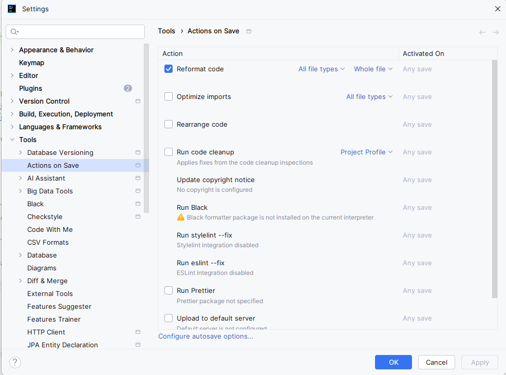
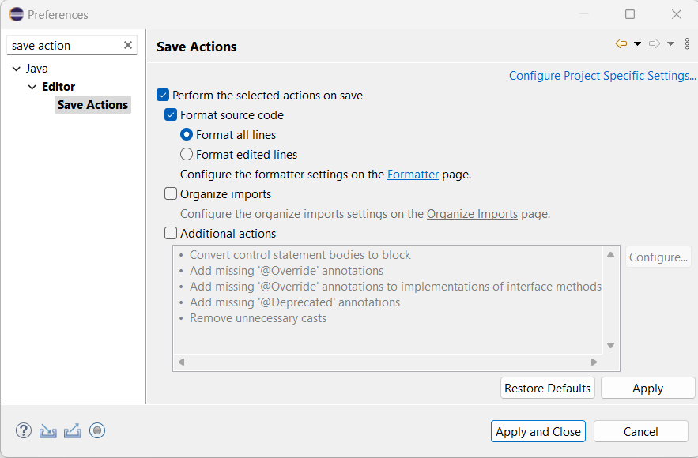

# Dataspace Ecosystem Code Style Guide

This repository uses a specific code style configuration for the Java programming language. The configuration is based
on the [Google Java Style Guide](https://checkstyle.sourceforge.io/google_style.html), with some modifications to suit
our needs. The configuration is defined in an XML file located in the `resources` directory.

The usage of this code style configuration is enforced through the Checkstyle tool, which can be integrated into your
IDE or run as part of the build process.

By using this code style configuration, we aim to maintain a consistent coding style across the project, making it
easier for developers to read and understand the code.

## Running Checkstyle

The Checkstyle can be run using Gradle:

```bash
./gradlew checkstyleMain checkstyleTest
```

If any violation is found, this execution will trigger a build failure.

Moreover, if you are using an IDE, you can also run Checkstyle as a plugin:

- [Checkstyle-IDEA](https://plugins.jetbrains.com/plugin/1065-checkstyle-idea) for IntelliJ IDEA
- [Checkstyle-Eclipse](https://checkstyle.org/eclipse-cs/#!/) for Eclipse

By installing the Checkstyle plugin in your IDE, you can get real-time feedback on your code style violations as you
write code. This can help you catch issues early and ensure that your code adheres to the project's coding standards.

After the installation, you can configure the Checkstyle plugin to use the
provided [XML configuration file](resources/checkstyle-config.xml). This will ensure that the plugin checks your code
against the same rules that are enforced in the CI build process.

## PR checkstyle validation

Besides running Checkstyle locally, we also run it on our GitHub Actions pipeline. This could result in failing GitHub
Action pipelines, and reviewers might reject PRs due to Checkstyle violations.
Thus, it is **highly** recommended to run Checkstyle locally as well.

## [Optional] Configure code formating save action in IDE

To ensure that your code is always formatted according to the project's coding style, you can configure your IDE to
automatically format your code on save. This can help you avoid Checkstyle violations and maintain a consistent coding
style throughout the project.

### IntelliJ IDEA



### Eclipse


