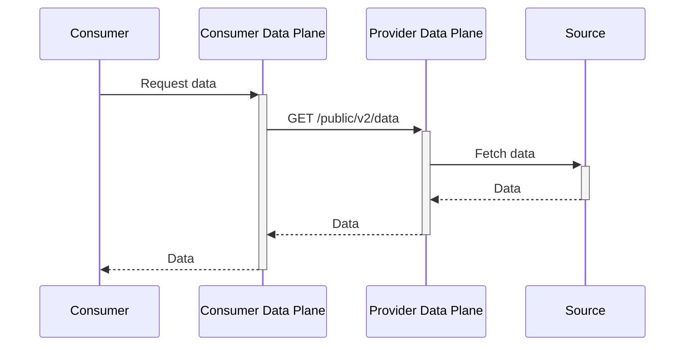
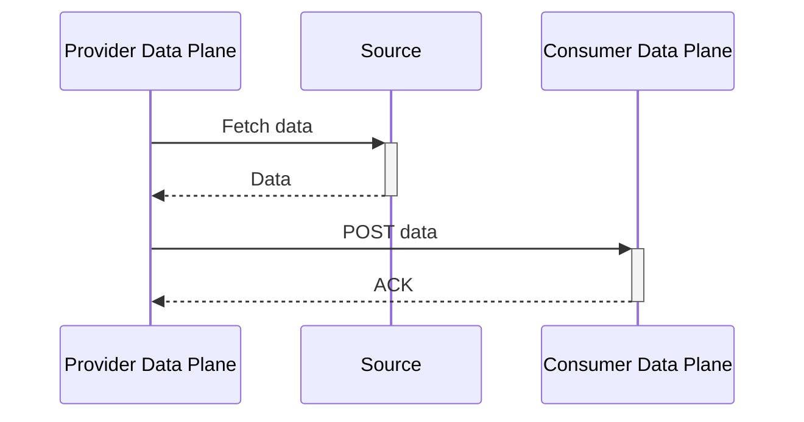

# Data Plane API

The Data Plane handles actual data transfer operations and is accessed through the API Gateway with consumer participant identifiers.

## Base URL

```
{{protocol}}://{{apiGatewayHost}}/{{consumerId}}/dp
```


## Data Access API

### Access Data

After a successful transfer process initiation, consumers access data using the contract agreement ID:

```http
GET /{{consumerId}}/dp/data
Contract-Id: {{contractAgreementId}}
Authorization: {{contractAgreementId}}
```


### Access Data with Query Parameters

Route to specific sub-resources or filter data:

```http
GET /{{consumerId}}/dp/data?start=2024-07-28T14:00:00&end=2024-07-29T20:00:00&limit=10
Contract-Id: {{contractAgreementId}}
Authorization: {{contractAgreementId}}
```

**Query Parameters:**
- `start`: Start timestamp for data filtering
- `end`: End timestamp for data filtering  
- `direction`: Data direction filter
- `limit`: Maximum number of records to return
- `projectId`: Project identifier for scoped data access
- `apiKey`: Additional API key for backend data source

## Transfer Types

### HTTP Pull

Consumer pulls data through the Data Plane using `HttpData-PULL` transfer type:



### HTTP Push

Provider pushes data to consumer endpoint:




## Authentication

### Contract-Based Authentication

Data transfers use contract agreement IDs for authentication:

```http
Contract-Id: {{contractAgreementId}}
Authorization: {{contractAgreementId}}
```

**Headers:**
- `Contract-Id`: Contract agreement identifier from negotiation
- `Authorization`: Same contract agreement ID used for authorization

### Authentication Flow

1. Complete contract negotiation to obtain `contractAgreementId`
2. Initiate transfer process with `HttpData-PULL` type
3. Use contract agreement ID in both `Contract-Id` and `Authorization` headers
4. Include API management key for gateway access

## Environment Variables Used

The following variables are commonly used in data plane requests:

- `{{protocol}}`: HTTP or HTTPS
- `{{apiGatewayHost}}`: API Gateway hostname
- `{{consumerId}}`: Consumer participant identifier
- `{{contractAgreementId}}`: Contract agreement identifier from negotiation

## Error Handling

### Transfer Errors

```json
{
  "@type": "DataFlowError",
  "errorCode": "TRANSFER_FAILED",
  "message": "Failed to connect to source",
  "processId": "transfer-1"
}
```

### Common Error Codes

| Code | Description |
|------|-------------|
| `401 Unauthorized` | Invalid contract ID or API key |
| `403 Forbidden` | Contract agreement not valid or expired |
| `404 Not Found` | Data source not available |
| `500 Internal Server Error` | Backend data source error |
| `502 Bad Gateway` | Provider backend unavailable |
| `504 Gateway Timeout` | Request timeout to provider |

## See Also

- [Quick Start](../../getting-started/quick-start.md) — Deploy services and start making API calls
- [API Overview](overview.md) — Common patterns, authentication, and end-to-end workflow
- **[Data Plane Architecture](../components/data-plane.md)** — Understand the component behind these APIs: transfer types (HTTP Pull/Push), pipeline service, data sources/sinks, and extension points
- [Control Plane API](control-plane-api.md) — You must negotiate a contract via the Control Plane API before accessing data here
