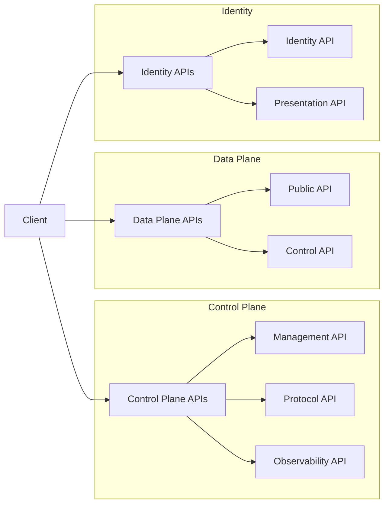
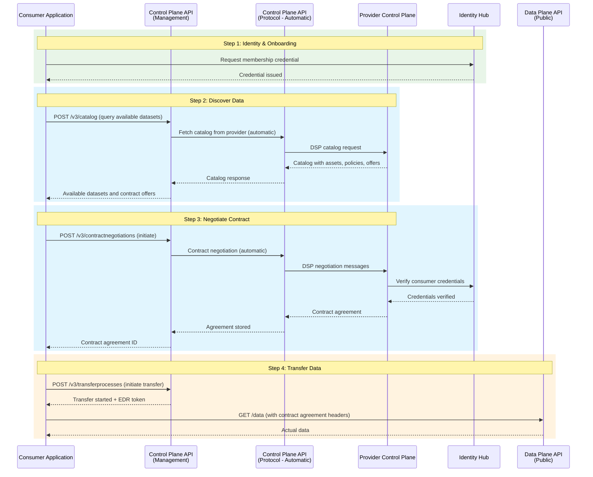

# API Reference Overview

The Dataspace Ecosystem exposes several REST APIs for management and runtime operations. This page covers the overall API structure, common patterns, authentication, and how APIs relate to the system architecture.

!!! info "Understanding the Architecture"
    Each API in the Dataspace Ecosystem is exposed by a specific architectural component. If you're unfamiliar with the system design, reading the [System Overview](../system-overview.md) and [Architecture Index](../index.md) first will help you understand *why* each API exists and *when* to use it.

## API Structure



## How APIs Map to Architecture

The table below maps each API to its architectural component, explaining what role it plays in the overall ecosystem. Use the architecture links to understand the component's design, and the API links to see endpoint details.

| API | Architecture Component | Role in the Ecosystem | When You Use It |
|-----|----------------------|----------------------|-----------------|
| [Control Plane Management](control-plane-api.md) | [Control Plane](../components/control-plane.md) | Central management API for all business operations — assets, policies, contracts, catalog queries, and transfer process initiation | As a **Provider**: registering data offerings. As a **Consumer**: discovering data and negotiating contracts |
| [Control Plane Protocol](control-plane-api.md) | [Control Plane](../components/control-plane.md) | Automated inter-connector communication using the Dataspace Protocol (DSP/IDS) | You don't call this directly — it's used automatically by Control Planes to talk to each other |
| [Data Plane Public](data-plane-api.md) | [Data Plane](../components/data-plane.md) | Data access endpoints — the actual data flows through here after a contract is agreed | As a **Consumer**: pulling data after a successful transfer process |
| [Data Plane Control](data-plane-api.md) | [Data Plane](../components/data-plane.md) | Internal API used by the Control Plane to orchestrate data transfers | You don't call this directly — it's used internally by the system |
| [Identity Hub](identity-api.md) | [Identity Hub](../components/identity-hub.md) | Manages decentralized identities (DIDs) and verifiable credentials (VCs) | During **onboarding**: requesting membership credentials. During **runtime**: credential verification happens automatically |
| [Issuer Service Admin](identity-api.md) | [Identity Hub](../components/identity-hub.md) | Administrative API for the Dataspace Authority to define credential types and manage holders | As the **Authority**: setting up credential definitions and attesting participant memberships |

## Typical End-to-End Workflow

The following sequence diagram shows the complete happy-path flow from a consumer's perspective — from discovering data to receiving it. Each step indicates which API is involved.



### Workflow Steps Explained

| Step | API Endpoints | What Happens |
|------|--------------|-------------|
| **1. Onboard** | `POST /identity/.../credentials/request` | Your organization obtains a membership credential from the dataspace authority. This is a one-time setup step. |
| **2. Discover** | `POST /management/v3/catalog` | Query what data is available. The Control Plane automatically contacts providers via the Protocol API and returns a catalog of datasets with their usage policies. |
| **3. Negotiate** | `POST /management/v3/contractnegotiations` | Initiate a contract negotiation for a specific dataset. The Control Planes handle the entire negotiation automatically using the DSP protocol. You poll the negotiation status until it reaches `FINALIZED`. |
| **4. Transfer** | `POST /management/v3/transferprocesses` then `GET /dp/data` | Start a transfer process to get access credentials (EDR), then use them to pull data from the Data Plane. |

## Available APIs

| API | Base Path | Description |
|-----|-----------|-------------|
| [Control Plane Management](control-plane-api.md) | `/management` | Asset, policy, and contract management |
| [Control Plane Protocol](control-plane-api.md) | `/protocol` | IDS protocol endpoints |
| [Data Plane Public](data-plane-api.md) | `/public` | Data transfer endpoints |
| [Data Plane API](data-plane-api.md) | `/control` | Transfer control |
| [Identity Hub](identity-api.md) | `/identity` | DID and credential management |

## Authentication

### API Key (Development)

```bash
curl -H "X-Api-Key: password" http://localhost:8181/management/v3/assets
```

### OAuth 2.0

```bash
curl -H "Authorization: Bearer <token>" http://localhost:8181/management/v3/assets
```

### Verifiable Credentials

For protocol endpoints, authentication uses verifiable credentials and DID resolution.

## Common Patterns

### Request Format

All APIs use JSON-LD:

```json
{
  "@context": {
    "@vocab": "https://w3id.org/edc/v0.0.1/ns/",
    "odrl": "http://www.w3.org/ns/odrl/2/"
  },
  "@type": "Asset",
  "@id": "asset-1",
  "properties": {
    "name": "My Asset"
  }
}
```

### Response Format

```json
{
  "@context": {
    "@vocab": "https://w3id.org/edc/v0.0.1/ns/"
  },
  "@type": "Asset",
  "@id": "asset-1",
  "createdAt": 1705312000000,
  "properties": {
    "name": "My Asset"
  }
}
```

### Error Response

```json
{
  "@type": "ApiErrorDetail",
  "message": "Asset not found",
  "type": "NOT_FOUND",
  "path": "/management/v3/assets/unknown-id",
  "invalidValue": "unknown-id"
}
```

### Pagination

```json
{
  "@context": { ... },
  "querySpec": {
    "offset": 0,
    "limit": 50,
    "sortField": "createdAt",
    "sortOrder": "DESC"
  }
}
```

### Filtering

```json
{
  "querySpec": {
    "filterExpression": [
      {
        "operandLeft": "asset:prop:type",
        "operator": "=",
        "operandRight": "data"
      }
    ]
  }
}
```

## HTTP Status Codes

| Code | Meaning |
|------|---------|
| `200` | Success |
| `201` | Created |
| `204` | No Content |
| `400` | Bad Request |
| `401` | Unauthorized |
| `403` | Forbidden |
| `404` | Not Found |
| `409` | Conflict |
| `500` | Server Error |

## OpenAPI Specifications

OpenAPI specs are available at:

- Control Plane: `http://localhost:8181/api/management/openapi.yaml`
- Data Plane: `http://localhost:8383/api/public/openapi.yaml`
- Published merged spec: [Published OpenAPI Spec](openapi-spec.md)

## API Versioning

APIs are versioned in the URL path:

- Current: `/v3/`
- Legacy: `/v2/` (deprecated)

## Rate Limiting

Production deployments may include rate limiting:

```http
X-RateLimit-Limit: 1000
X-RateLimit-Remaining: 999
X-RateLimit-Reset: 1705315600
```

## See Also

- [Control Plane API](control-plane-api.md)
- [Data Plane API](data-plane-api.md)
- [Identity API](identity-api.md)
- [Architecture Index](../index.md) — Understand how components and APIs relate
- [System Overview](../system-overview.md) — High-level architecture diagram
