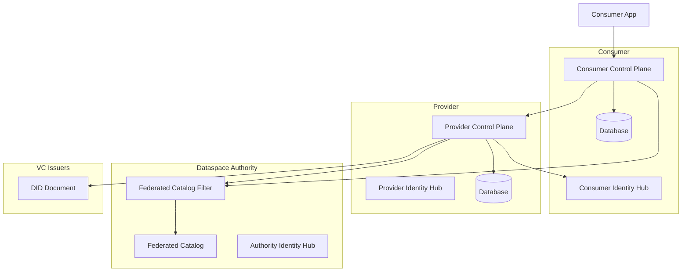
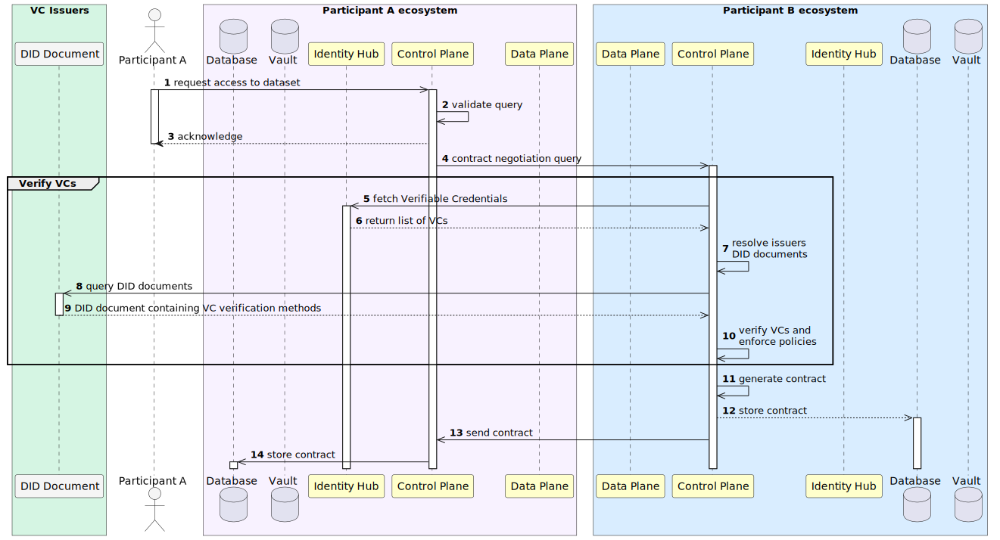
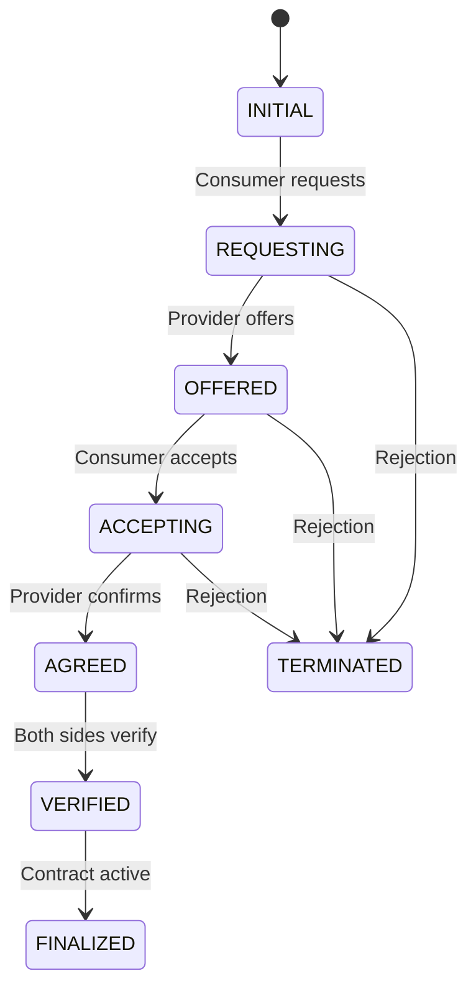

# Control Plane Architecture

The Control Plane is the management layer of the Dataspace Ecosystem, responsible for handling contracts, policies, assets, and catalog operations.

## Overview



## Components

### Management API

RESTful API for managing all control plane resources:

- [/v3/assets](../components-api/control-plane-api.md#assets) - Asset management
- [/v3/policies](../components-api/control-plane-api.md#policy-definitions) - Policy definitions
- [/v3/contractdefinitions](../components-api/control-plane-api.md#contract-definitions) - Contract definitions
- [/v3/contractnegotiations](../components-api/control-plane-api.md#contract-negotiations) - Contract negotiations
- [/v3/catalog](../components-api/control-plane-api.md#catalog) - Catalog operations

### Asset Service

Manages data assets within the dataspace. See [Asset API documentation](../components-api/control-plane-api.md#assets) for detailed endpoint information.

### Policy Service

Defines and evaluates usage policies using ODRL. See [Policy Definitions API documentation](../components-api/control-plane-api.md#policy-definitions) for detailed endpoint information.

### Contract Definition Service

Links assets with policies to create offerings. See [Contract Definitions API documentation](../components-api/control-plane-api.md#contract-definitions) for detailed endpoint information.

### Contract Negotiation Service

Handles the negotiation protocol between participants. See [Contract Negotiations API documentation](../components-api/control-plane-api.md#contract-negotiations) for detailed endpoint information.

#### Contract Negotiation Flow

The following diagram illustrates the contract negotiation process between a consumer and provider:

<!-- Source: ../_diagrams/contract_negotiation.puml — Generated using: https://www.plantuml.com/plantuml -->


## State Machine of the contract negotiation

The contract negotiation follows an automated state machine protocol between control planes:



**Note**: This entire negotiation process is **automated** and handled by the control planes using the IDS protocol. The "Consumer requests", "Provider offers", etc. represent protocol messages exchanged automatically between the systems, not manual user actions. Once a consumer application initiates a data request, the control planes handle the entire negotiation flow automatically based on predefined policies and contract definitions.

## Configuration

Control Plane configuration can be provided through multiple methods:

### Application Properties File

Create `application.properties` in your launcher's resources:

```properties
# Control Plane Configuration
edc.hostname=localhost
web.http.port=8181
web.http.path=/api
web.http.management.port=8182
web.http.management.path=/management
web.http.protocol.port=8282
web.http.protocol.path=/protocol
```

### Environment Variables

Set configuration via environment variables (prefix with `EDC_`):

```bash
export EDC_HOSTNAME=localhost
export EDC_WEB_HTTP_PORT=8181
export EDC_WEB_HTTP_PATH=/api
export EDC_WEB_HTTP_MANAGEMENT_PORT=8182
export EDC_WEB_HTTP_MANAGEMENT_PATH=/management
export EDC_WEB_HTTP_PROTOCOL_PORT=8282
export EDC_WEB_HTTP_PROTOCOL_PATH=/protocol
```

### Launcher Configuration

In launcher build configurations (e.g., `launchers/control-plane/postgresql-hashicorpvault/`):

```java
// Via @Setting annotations in extension classes
@Setting(description = "Control plane hostname", key = "edc.hostname", defaultValue = "localhost")
private String hostname;
```

### Docker/Kubernetes

For containerized deployments, use environment variables in your deployment manifests:

```yaml
apiVersion: apps/v1
kind: Deployment
spec:
  template:
    spec:
      containers:
      - name: control-plane
        env:
        - name: EDC_HOSTNAME
          value: "my-control-plane.example.com"
        - name: EDC_WEB_HTTP_PORT
          value: "8181"
```

## Extension Points

### Policy Evaluation Functions

Register custom policy constraint functions for different scopes (based on `PolicyEvaluationExtension`):

```java
public class PolicyEvaluationExtension implements ServiceExtension {
    
    @Inject
    private PolicyEngine policyEngine;
    
    @Inject
    private RuleBindingRegistry ruleBindingRegistry;
    
    @Override
    public void initialize(ServiceExtensionContext context) {
        // Register functions for different policy contexts
        policyEngine.registerFunction(
            CatalogPolicyContext.class, 
            Permission.class, 
            new MembershipConstraintFunction<>()
        );
        policyEngine.registerFunction(
            ContractNegotiationPolicyContext.class, 
            Permission.class, 
            new MembershipConstraintFunction<>()
        );
        policyEngine.registerFunction(
            TransferProcessPolicyContext.class, 
            Permission.class, 
            new MembershipConstraintFunction<>()
        );
    }
}
```

### Policy Scopes

| Scope | Context Class | Description |
|-------|--------------|-------------|
| `catalog` | `CatalogPolicyContext` | Catalog access policies |
| `contract.negotiation` | `ContractNegotiationPolicyContext` | Contract negotiation policies |
| `transfer.process` | `TransferProcessPolicyContext` | Transfer process policies |
| `catalog.discovery` | `CatalogDiscoveryPolicyContext` | Federated catalog discovery |

## See Also

- **[Control Plane API Reference](../components-api/control-plane-api.md)** — To see the REST endpoints exposed by this component, including request/response examples for assets, policies, contracts, catalog queries, and transfers
- [Data Plane Architecture](data-plane.md) — The component that handles actual data transfer after contracts are negotiated here
- [Identity Hub Architecture](identity-hub.md) — Provides the credential verification used during contract negotiation
- [API Reference Overview](../components-api/overview.md) — End-to-end API workflow showing how the Control Plane fits into the full data exchange flow
