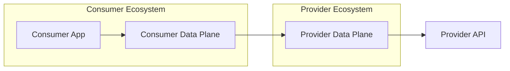
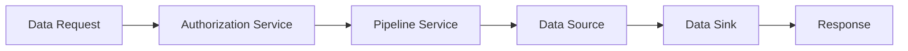
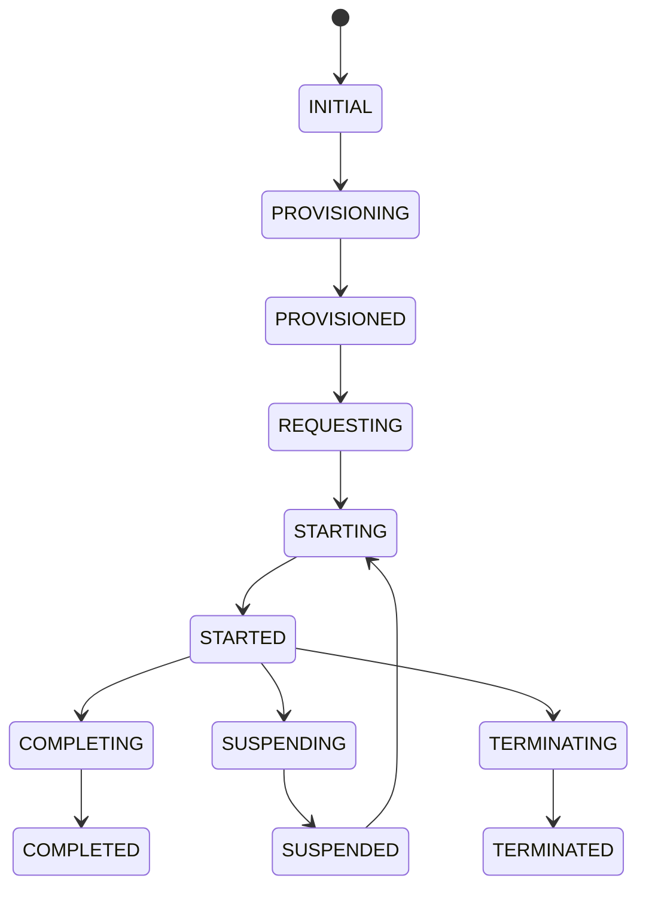
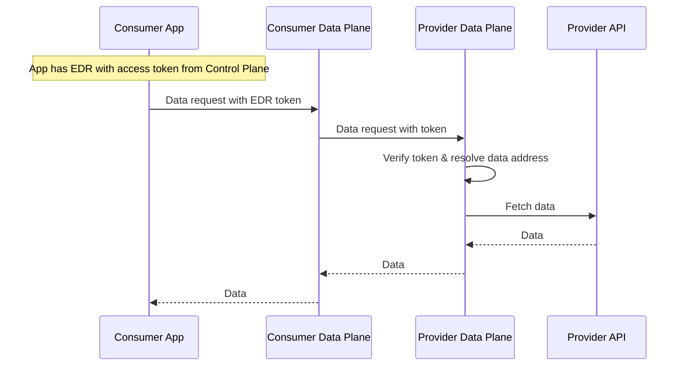
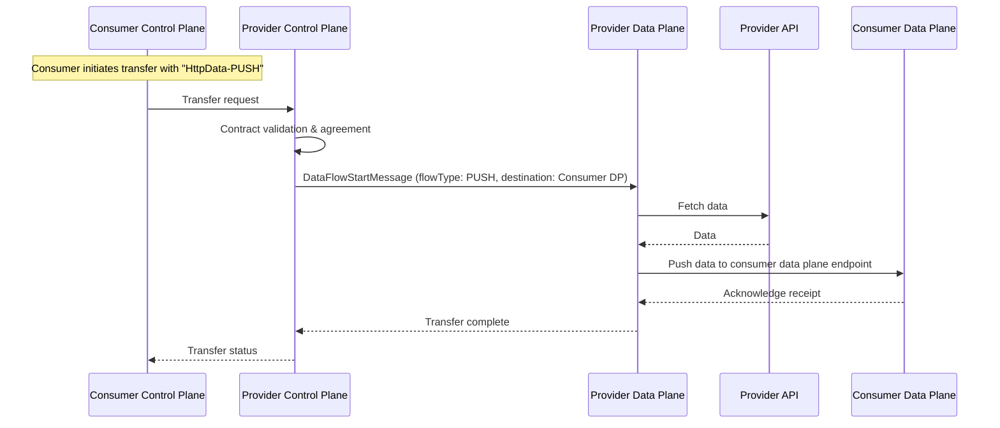

# Data Plane Architecture

The Data Plane handles the actual data transfer between participants after a contract agreement has been established.

## Overview



## Components

### Public API Controller

Handles incoming data requests via REST endpoints (GET, POST, PUT, DELETE, PATCH):

- Authorizes requests via `DataPlaneAuthorizationService`
- Creates `DataFlowStartMessage` for pipeline processing
- Uses `PipelineService` for data transfer
- Supports async streaming via `AsyncStreamingDataSink`

### Pipeline Service

Orchestrates data flow between sources and sinks:



### Transfer States



### Data Sources

Connect to various data backends:

| Type | Description |
|------|-------------|
| `HttpData` | HTTP/REST endpoints |
| `AmazonS3` | AWS S3 buckets |
| `AzureStorage` | Azure Blob Storage |
| `Kafka` | Apache Kafka topics |
| `Database` | SQL databases |

### Data Sinks

Deliver data to consumers:

```json
{
  "dataDestination": {
    "@type": "DataAddress",
    "type": "HttpProxy",
    "baseUrl": "https://consumer.example.com/data"
  }
}
```

## Transfer Types

### HTTP Pull (Data Proxy)

Consumer pulls data through their Data Plane, which proxies to the provider:



### HTTP Push

Provider initiates data transfer by pushing data to consumer data plane:




## Configuration

```properties
# Data Plane Configuration
edc.hostname=localhost
web.http.port=8383
web.http.path=/api
web.http.public.port=8484
web.http.public.path=/public
web.http.control.port=8585
web.http.control.path=/control
```

## Extension Points

### Custom Data Source

```java
@Provider
public class CustomDataSourceFactory implements DataSourceFactory {
    
    @Override
    public String supportedType() {
        return "CustomType";
    }
    
    @Override
    public DataSource createSource(DataFlowStartMessage request) {
        // Create custom data source
    }
}
```

### Custom Transfer Type

```java
@Extension(value = "Custom Transfer Extension")
public class CustomTransferExtension implements ServiceExtension {
    
    @Inject
    private TransferTypeManager manager;
    
    @Override
    public void initialize(ServiceExtensionContext context) {
        manager.registerTransferType(new CustomTransferType());
    }
}
```

## Security

### Data Encryption

- TLS for data in transit
- Optional payload encryption
- Token-based authentication

### Access Control

- Contract-based authorization
- Token validation
- Rate limiting

## See Also

- **[Data Plane API Reference](../components-api/data-plane-api.md)** — To see the REST endpoints exposed by this component, including data access examples, authentication headers, and error codes
- [Control Plane Architecture](control-plane.md) — The component that initiates transfers and provides contract agreement IDs used by the Data Plane
- [Telemetry Architecture](telemetry.md) — How data consumption is tracked for billing after transfers complete
- [API Reference Overview](../components-api/overview.md) — End-to-end API workflow showing how the Data Plane fits into the full data exchange flow
