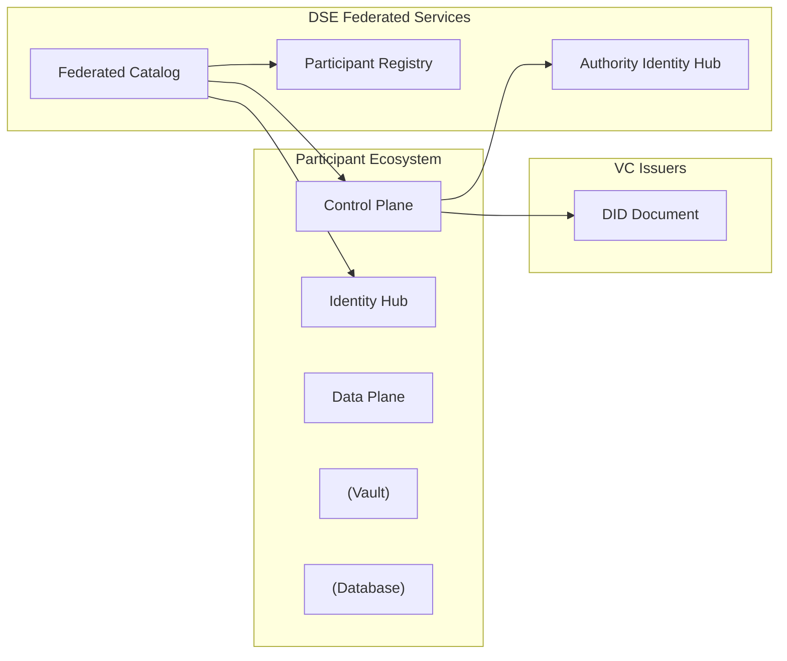
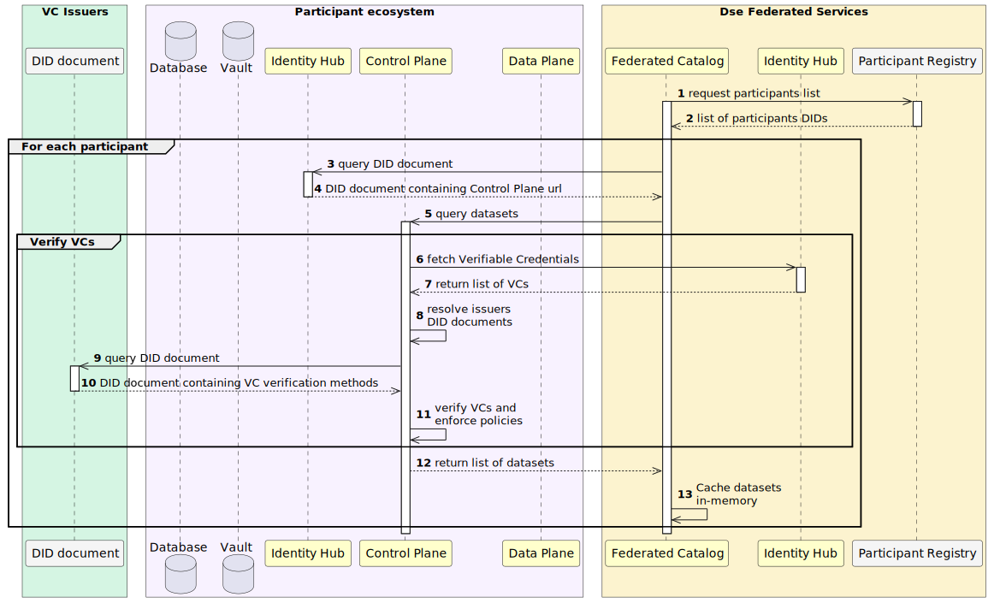
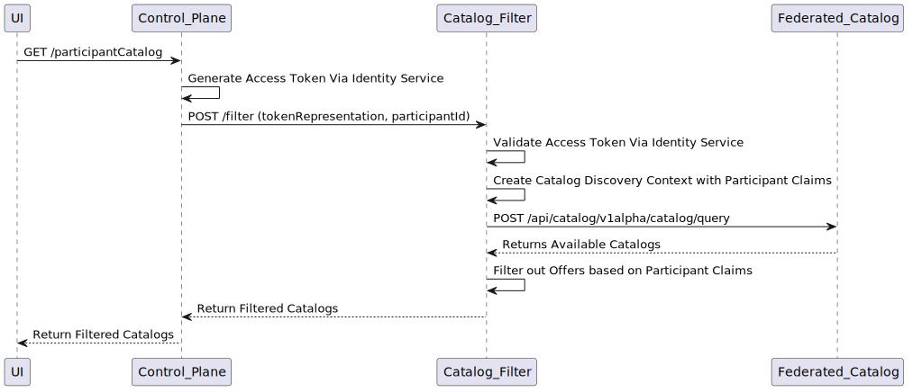

# Federated Catalog Architecture

The Federated Catalog enables discovery of data offerings across all participants in the dataspace.

## Overview



## Components

### Participant Registry

Maintains the list of all participants in the dataspace:

- Stores participant DIDs
- Provides participant discovery
- Enables per-participant catalog crawling

### Federated Catalog Crawler

Fetches catalogs from all registered participants:

- Queries Participant Registry for DIDs
- Resolves Control Plane URLs via Identity Hub
- Periodic crawling based on configuration
- In-memory caching of datasets

### Catalog Filter Service

Provides VC-based filtering of catalog entries:

```java
@Extension("VC-based Catalogue Filter Extension")
public class VcCatalogFilterExtension implements ServiceExtension {
    @Inject
    private PolicyEngine policyEngine;
    
    @Inject
    private IdentityService identityService;
    
    @Setting(description = "Authority did", key = "dse.authority.did", required = true)
    public String authorityDid;
}
```

## Catalog Crawling Flow

<!-- Source: ../_diagrams/catalog_request.puml — Generated using: https://www.plantuml.com/plantuml -->


### Configuration

```yaml
# Federated Catalog Crawler Configuration (from Terraform)
crawler:
  cache:
    executionPeriodSeconds: 10   # Crawl interval
    executionDelaySeconds: 10    # Initial delay before first crawl
```

## VC-Based Filtering

The Federated Catalog Filter uses Verifiable Credentials for access control:

<!-- Source: ../_diagrams/catalog_filter.puml — Generated using: https://www.plantuml.com/plantuml -->


### Filter Types

- **VC-based**: Filter based on Verifiable Credentials in participant's token
- **Policy-based**: Evaluate ODRL policies via PolicyEngine
- **Participant-based**: Match datasets by participant DID

## See Also

- [System Overview](../system-overview.md) — High-level architecture diagram showing how the Federated Catalog relates to all other components
- [Control Plane Architecture](control-plane.md) — Consumers discover data via Control Plane catalog queries, which may route through the Federated Catalog
- [Identity Hub Architecture](identity-hub.md) — The Federated Catalog uses DIDs and VCs during catalog crawling and VC-based filtering
- [Control Plane API Reference](../components-api/control-plane-api.md#catalog) — The catalog query endpoint that consumers use to discover data offerings
- [API Reference Overview](../components-api/overview.md) — End-to-end API workflow showing how catalog discovery fits into the full data exchange flow
