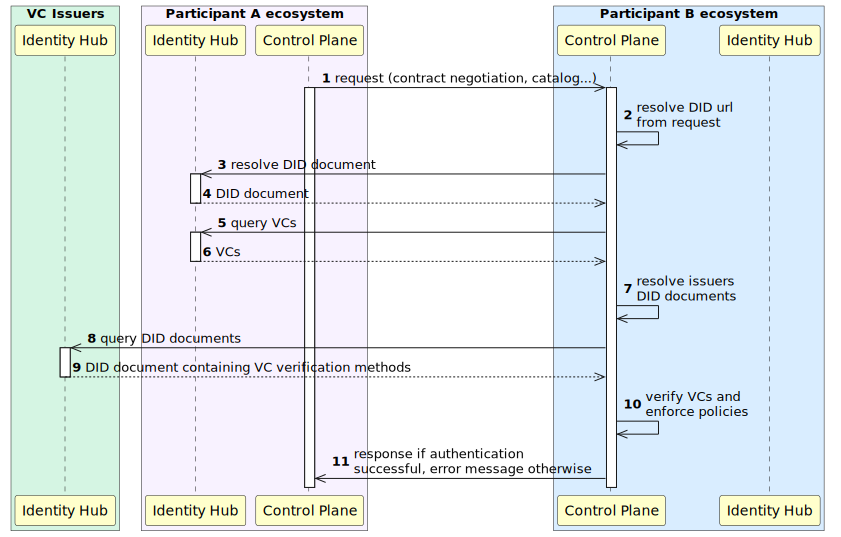
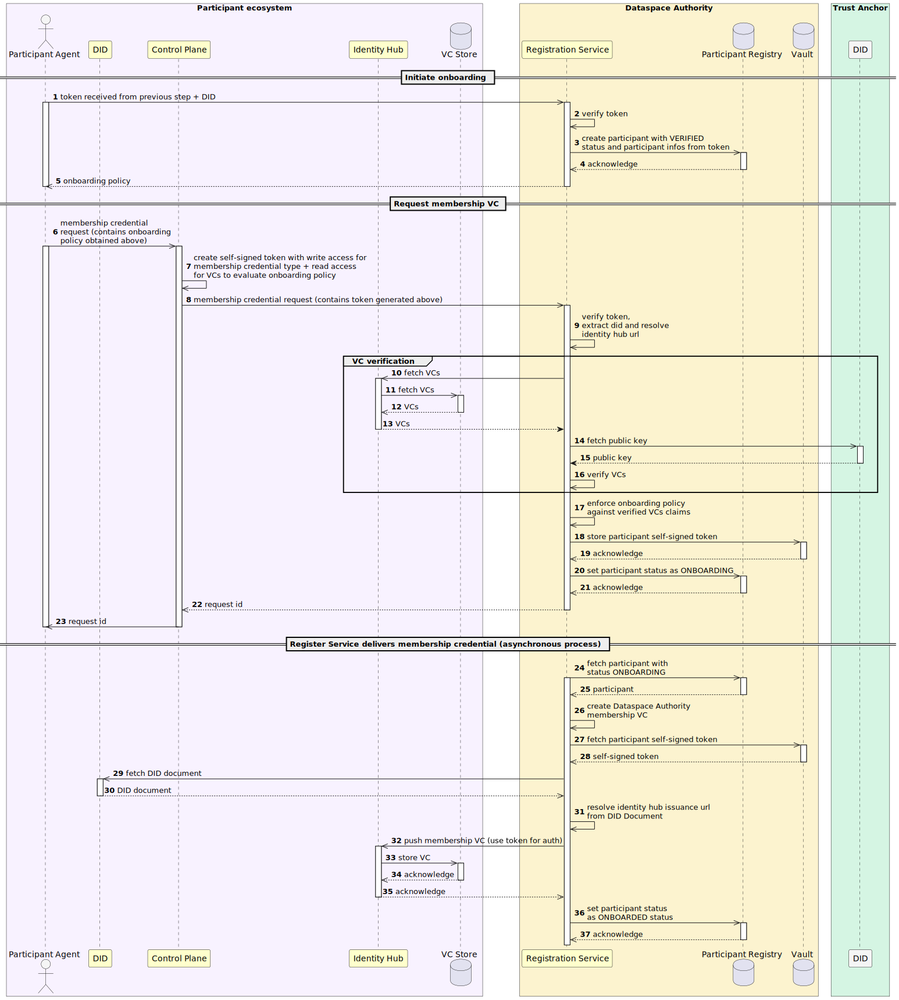

# Identity Hub Architecture

The Identity Hub manages decentralized identities, verifiable credentials, and trust establishment between participants.

## Overview

<!-- Source: ../_diagrams/vc_authorization_flow.puml — Generated using: https://www.plantuml.com/plantuml -->


<!-- Source: ../../onboarding/_diagrams/technical_onboarding.puml — Generated using: https://www.plantuml.com/plantuml -->


## Components

### API Endpoints

The Identity Hub exposes multiple API endpoints (from Helm chart configuration):

| Endpoint | Port | Path | Purpose |
|----------|------|------|---------|
| Default | 8080 | /api | Health checks |
| Identity | 8181 | /api/identity | Identity management |
| Credentials | 8282 | /api/credentials | VC storage and retrieval |
| DID | 8383 | /api/did | DID document resolution |
| STS | 8484 | /api/sts | Secure Token Service |

### DID WebParser Extension

Parses DID Web identifiers:

```java
@Extension(value = DidWebParserExtension.NAME)
public class DidWebParserExtension implements ServiceExtension {
    @Provider
    public DidWebParser didWebParser(ServiceExtensionContext context) {
        return new DidWebParser() {
            @Override
            public String parse(URI url, Charset charset) {
                return context.getParticipantId();
            }
        };
    }
}
```

### Scope to Criterion Transformer

Transforms scope strings into query criteria for credential retrieval:

```java
public class DseScopeToCriterionTransformer implements ScopeToCriterionTransformer {
    protected static final String TYPE_OPERAND = "verifiableCredential.credential.type";
    protected static final String CONTAINS_OPERATOR = "contains";
    
    @Override
    public Result<Criterion> transform(String scope) {
        var tokens = tokenize(scope);
        var credentialType = tokens.getContent()[1];
        return success(new Criterion(TYPE_OPERAND, CONTAINS_OPERATOR, credentialType));
    }
    
    // Scope format: <alias>:<credentialType>:<operation>
    // Example: dse:MembershipCredential:read
}
```

### Participant Context Seed

Seeds the super-user participant context on startup:

```java
public class ParticipantContextSeedExtension implements ServiceExtension {
    @Setting(description = "STS public key alias", key = PUBLIC_KEY_ALIAS_PROPERTY)
    private String publicKeyAlias;
    
    @Setting(description = "STS private key alias", key = PRIVATE_KEY_ALIAS_PROPERTY)
    private String privateKeyAlias;
    
    @Override
    public void start() {
        // Create super-user with admin role if not exists
        ParticipantManifest.Builder.newInstance()
            .participantId(participantId)
            .did(participantId)
            .active(true)
            .key(KeyDescriptor.Builder.newInstance()
                .keyId("%s#%s".formatted(participantId, "my-key"))
                .privateKeyAlias(privateKeyAlias)
                .publicKeyPem(publicKeyPem)
                .build())
            .roles(List.of(ROLE_ADMIN));
    }
}
```

## VC Authorization Flow

<!-- Source: ../_diagrams/vc_authorization_flow.puml — Generated using: https://www.plantuml.com/plantuml -->


## Onboarding Flow

<!-- Source: ../../onboarding/_diagrams/technical_onboarding.puml — Generated using: https://www.plantuml.com/plantuml -->


## Supported DID Methods

| Method | Description |
|--------|-------------|
| `did:web` | Web-based DIDs using HTTPS (primary method) |

### DID Document Structure

```json
{
  "@context": ["https://www.w3.org/ns/did/v1"],
  "id": "did:web:identityhub:8383:api:did",
  "verificationMethod": [{
    "id": "did:web:identityhub:8383:api:did#my-key",
    "type": "JsonWebKey2020",
    "controller": "did:web:identityhub:8383:api:did",
    "publicKeyJwk": { ... }
  }],
  "service": [
    {
      "type": "CredentialService",
      "serviceEndpoint": "http://identityhub:8282/api/credentials"
    }
  ]
}
```

## Credential Types

### Membership Credential

Attests participant membership in the DSE dataspace:

```json
{
  "@context": ["https://www.w3.org/2018/credentials/v1"],
  "type": ["VerifiableCredential", "MembershipCredential"],
  "issuer": "did:web:authority.example.com",
  "credentialSubject": {
    "id": "did:web:participant.example.com",
    "membershipStatus": "active",
    "memberSince": "2024-01-01"
  }
}
```

### Scope-based VC Query

Credentials are queried using scopes in format: `<alias>:<credentialType>:<operation>`

```
dse:MembershipCredential:read
dse:VerifiableCredential:*
dse:ComplianceCredential:all
```

## Configuration

```yaml
# Identity Hub Helm Configuration
identityhub:
  did:
    web:
      url: "did:web:identityhub%3A8383:api:did"
      useHttps: false
  keys:
    sts:
      privateKeyAlias: "<did>-sts-privatekey"
      publicKeyAlias: "<did>-sts-publickey"
  endpoints:
    identity:
      port: 8181
      path: /api/identity
    credentials:
      port: 8282
      path: /api/credentials
    did:
      port: 8383
      path: /api/did
    sts:
      port: 8484
      path: /api/sts
```

## Extension Points

### IdentityHubIatpExtension

Provides IATP (Identity and Trust Protocol) support.

### Custom Credential Store

Filters credentials during storage.

## Deployment

```yaml
# Terraform configuration (from system-tests)
locals {
  did_url = "did:web:${local.identityhub_release_name}%3A8383:api:did"
  sts_url = "http://${local.identityhub_release_name}:8484/api/sts/token"
  identityhub_credentials_url = "http://${local.identityhub_release_name}:8282/api/credentials"
}
```

## See Also

- **[Identity API Reference](../components-api/identity-api.md)** — To see the REST endpoints exposed by this component, including credential request examples, issuer administration, DID format details, and error codes
- [Control Plane Architecture](control-plane.md) — Uses the Identity Hub during contract negotiation to verify participant credentials
- [Federated Catalog Architecture](federated-catalog.md) — Uses the Identity Hub to resolve participant DIDs during catalog crawling
- [API Reference Overview](../components-api/overview.md) — End-to-end API workflow showing how the Identity Hub fits into the full data exchange flow
