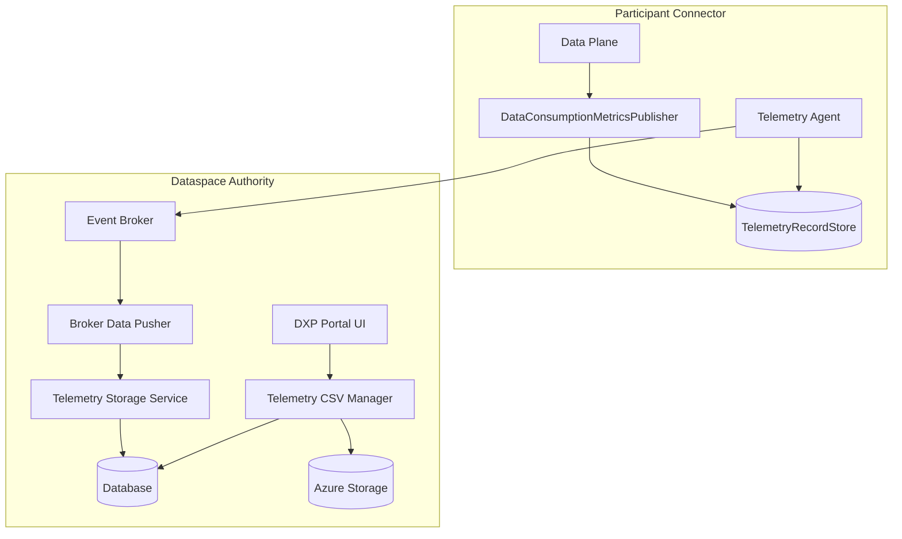
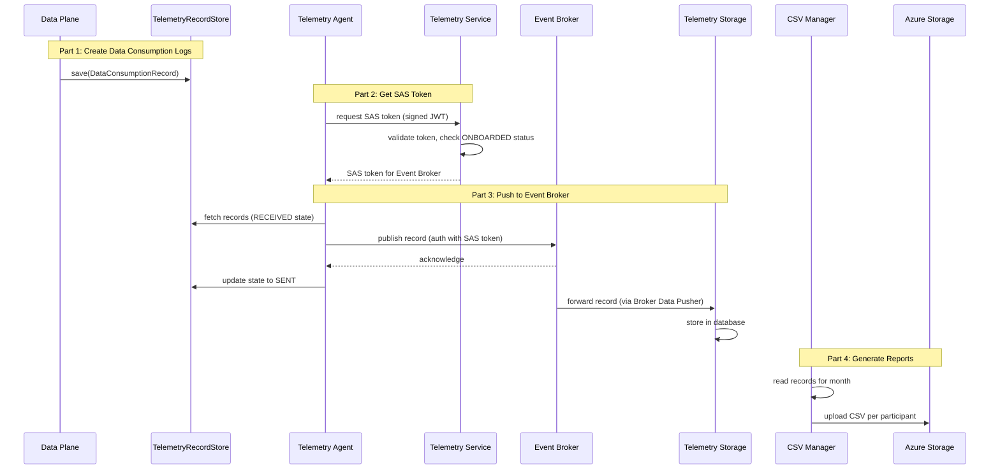

# Telemetry Architecture

The Telemetry system provides billing and data consumption tracking for the Dataspace Ecosystem. It enables participants to track data exchanges for billing purposes.

## Overview

The following diagram illustrates the end-to-end telemetry data flow, from data consumption logging to CSV report generation:

## Components

### Data Consumption Metrics Publisher

A `ContainerResponseFilter` registered in the Data Plane that intercepts each successfully processed data request. It captures the contract ID, response size, and status code, then persists them as `DataConsumptionRecord` objects in the local `TelemetryRecordStore`. Both consumer and provider data planes log consumption to enable cross-validation and fraud prevention.

### Telemetry Agent

A state machine that periodically polls the `TelemetryRecordStore` for records in `RECEIVED` state, publishes them to the Event Broker using a SAS token for authentication, and transitions successfully sent records to `SENT` state. Configurable batch size, retry limits, and backoff delays ensure reliable delivery.

### Telemetry Service

Provides SAS tokens for authenticating telemetry agents with the Event Broker. Upon receiving a token request containing a signed JWT with the participant's DID, the service verifies the token and checks the participant registry to confirm `ONBOARDED` status before issuing a time-limited SAS token.

### Telemetry Storage Service

Receives records forwarded from the Event Broker (via the Broker Data Pusher) and persists them in a database:

- REST API endpoint for receiving records
- SQL-backed storage for long-term persistence and CSV generation

### Telemetry CSV Manager

Generates periodic billing reports in CSV format per participant:

## Data Consumption Record

The core data structure for billing:

| Field | Type | Description |
|-------|------|-------------|
| `responseSize` | Long | Size of the response in bytes |
| `contractId` | String | The contract ID for the data exchange |
| `responseStatusCode` | Integer | HTTP response status code |
| `participantId` | String | Participant DID |
| `traceContext` | Map | OpenTelemetry trace context |

## Billing Flow

## SAS Token Authentication

The Telemetry Agent communicates with the Telemetry Service to obtain a SAS token for Event Broker access. The flow is as follows:

1. The agent creates a signed JWT containing the participant's DID in the `iss` claim
2. The Telemetry Service verifies the token signature and resolves the DID
3. The service checks the participant registry to confirm `ONBOARDED` status
4. If valid, a time-limited SAS token is generated and returned to the agent
5. The agent uses this token for all subsequent Event Broker communications

!!! info "Token Renewal"
    Telemetry agents must regenerate SAS tokens at regular intervals, as they expire based on the configured validity period (default: 300 seconds).

## CSV Report Generation

Reports are generated periodically and include per-participant summaries:

| Field | Description |
|-------|-------------|
| Contract ID | Identifier for the data exchange contract |
| Total Size | Sum of all message sizes in bytes |
| Message Count | Number of messages received |
| Response Status Codes | HTTP status codes of the data exchanges |

## Fraud Prevention

The CSV Manager validates data consistency:

- Message size discrepancies between consumer and provider
- Inconsistent message counts
- More than two participants per contract (invalid, since contracts are between exactly two participants)

## See Also

- [Billing Documentation](../../billing/index.md) — Detailed billing workflows and CSV report generation
- [System Overview](../system-overview.md) — High-level architecture diagram showing how Telemetry components relate to the rest of the ecosystem
- [Data Plane Architecture](data-plane.md) — Where data consumption records originate (the Data Plane logs every data exchange)
- [API Reference Overview](../components-api/overview.md) — End-to-end API workflow showing how telemetry/billing fits as the final step in the data exchange flow
