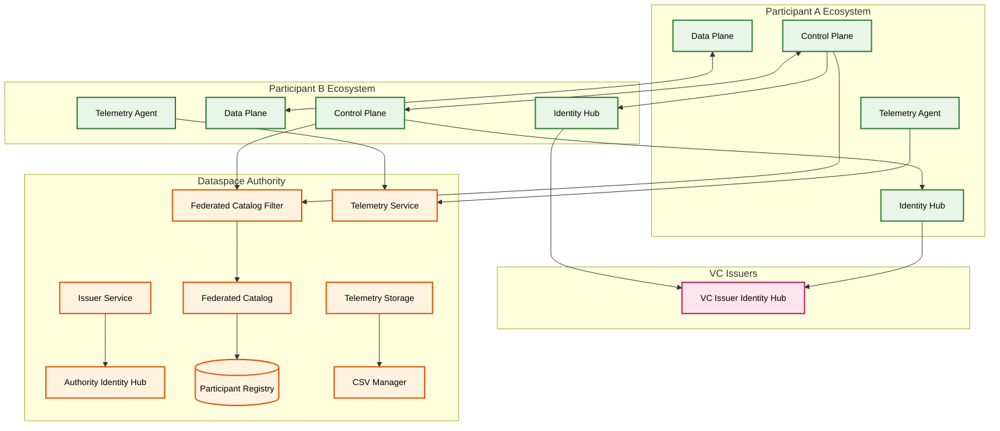

# System Overview

This document provides a high-level overview of the Dataspace Ecosystem architecture.

The Dataspace Ecosystem enables interoperable, policy-governed, and auditable data exchange across organizational boundaries. It aligns with emerging dataspace standards (e.g. GAIA-X / IDS concepts) and leverages the Eclipse EDC components.

## Architecture Diagram

### Full System Overview

For reference, here is the consolidated view of all components and their relationships:



## Component Overview

### Participant Components

Each participant in the dataspace deploys these components:

| Component | Responsibility |
|-----------|----------------|
| [Control Plane](components/control-plane.md) | Manages contract negotiations and policy evaluations |
| [Data Plane](components/data-plane.md) | Enables data transfers between participants |
| [Identity Hub](components/identity-hub.md) | Provides credential validation and DID resolution |
| [Telemetry Agent](components/telemetry.md) | Collects data consumption records for billing metrics |

### Dataspace Authority Components

Central services operated by the dataspace authority:

| Component | Responsibility |
|-----------|----------------|
| [Federated Catalog](components/federated-catalog.md) | Aggregates catalogs from all participants |
| Issuer Service | Issues membership credentials for participants |
| [Identity Hub](components/identity-hub.md) | Authority's credential store for VC verification |
| Participant Registry | Maintains list of onboarded participants |
| [Telemetry Service](components/telemetry.md) | Provides SAS tokens for telemetry agents |
| [Telemetry Storage](components/telemetry.md) | Stores telemetry events for billing metrics |
| [Telemetry CSV Manager](components/telemetry.md) | Generates billing reports per participant |

## Project Structure

```
dataspace-ecosystem/
├── core/                    # Default implementations
│   ├── common/              # Shared utilities (e.g., InMemoryTelemetryRecordStore)
│   ├── telemetry-agent-core/
│   ├── telemetry-service-core/
│   └── ...
├── extensions/              # Optional runtime features
│   ├── control-plane/       # Control plane extensions
│   ├── data-plane/          # Data plane extensions (billing metrics)
│   ├── federated-catalog/   # Catalog filter extensions
│   ├── identity-hub/        # IATP, DID parsing extensions
│   ├── issuer-service/      # Membership attestation
│   ├── telemetry-agent/     # Event publisher
│   ├── telemetry-service/   # SAS token generation
│   ├── telemetry-storage/   # Storage API and SQL store
│   └── telemetry-csv-manager/ # Report generation
├── launchers/               # Runtime configurations (PostgreSQL, HashiCorp Vault, Azure Vault)
├── spi/                     # Service Provider Interfaces
│   ├── common-spi/
│   ├── telemetry-agent-spi/
│   ├── telemetry-service-spi/
│   ├── telemetry-storage-spi/
│   ├── issuer-service-spi/
│   └── federated-catalog-filter-spi/
├── system-tests/            # Integration tests (Terraform, Kind)
├── charts/                  # Helm charts for Kubernetes deployment
└── docs/                    # Documentation
```

## Design Principles

### Extensibility

The core folder provides default implementations that can be overridden:

```java
// In core module - provides default implementation
@Provider(isDefault = true)
public class InMemoryTelemetryRecordStore implements TelemetryRecordStore {
    // Default in-memory implementation
}
```

Launchers inject production implementations:

```kotlin
// In launcher build.gradle.kts
runtimeOnly(project(":extensions:common:store:sql:telemetry-store-sql"))
// This replaces the default InMemoryTelemetryRecordStore with SQL implementation
```

### Separation of Concerns

| Module Type | Purpose | Example |
|-------------|---------|--------|
| **SPI** | Define interfaces and contracts | `TelemetryRecordStore`, `TelemetryService` |
| **Core** | Default implementations | `TelemetryAgentCoreExtension` |
| **Extension** | Specific functionality | `BillingConsumptionMetricsExtension` |
| **Launcher** | Wire implementations together | `telemetry-agent-postgresql-hashicorp` |

### Configuration-Driven

Behavior is controlled through settings:

```java
@Setting(description = "Authority DID", key = "dse.authority.did", required = true)
public String authorityDid;

@Setting(defaultValue = "azurite", description = "Blob Storage Type", key = "storage.type")
public String blobStorageType;
```

## Launcher Configurations

Available launcher variants:

| Component | Variants |
|-----------|----------|
| Control Plane | `postgresql-hashicorpvault`, `postgresql-azurevault` |
| Data Plane | `postgresql-hashicorpvault`, `postgresql-azurevault` |
| Identity Hub | `postgresql-hashicorpvault`, `postgresql-azurevault` |
| Federated Catalog | `postgresql-hashicorpvault`, `postgresql-azurevault` |
| Issuer Service | `postgresql-hashicorpvault`, `postgresql-azurevault` |
| Telemetry Agent | `postgresql-hashicorpvault`, `postgresql-azurevault` |
| Telemetry Service | `postgresql-hashicorpvault`, `postgresql-azurevault` |
| Telemetry Storage | `postgresql-hashicorpvault`, `postgresql-azurevault` |

## Communication Patterns

### Synchronous Operations

- DSP Protocol for contract negotiation
- DID resolution and VC verification
- Catalog queries

### Asynchronous Operations

- Data transfer processes (state machines)
- Telemetry record publishing to Event Broker
- CSV report generation (scheduled)

### Telemetry Data Flow

- **Telemetry Agents** request SAS tokens from **Telemetry Service** for authentication
- **Telemetry Agents** publish data records directly to **Event Broker** (external service)
- **Telemetry Storage** ingests events from **Event Broker** via API endpoints
- **CSV Manager** queries **Telemetry Storage** database to generate billing reports

## Security Model

### Authentication

- **Verifiable Credentials (VCs)**: Primary authentication mechanism
- **DID:web**: Decentralized identifiers for participant identity
- **Self-signed tokens**: For initial onboarding
- **SAS tokens**: For Event Broker access

### Authorization

- **ODRL Policies**: Define usage constraints on datasets
- **Policy Engine**: Evaluates policies during negotiation and catalog access
- **Membership Credentials**: Required for dataspace participation

## Next Steps

- Deep dive into [Control Plane](components/control-plane.md)
- Explore [Data Plane](components/data-plane.md) architecture
- Learn about [Identity Hub](components/identity-hub.md)
- Understand [Federated Catalog](components/federated-catalog.md)
- Review [Telemetry](components/telemetry.md) for billing
- Explore the full [API Reference](components-api/index.md) for endpoint details and request/response examples
