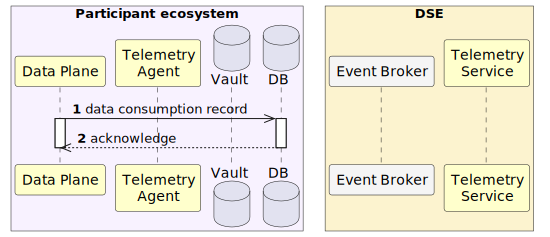
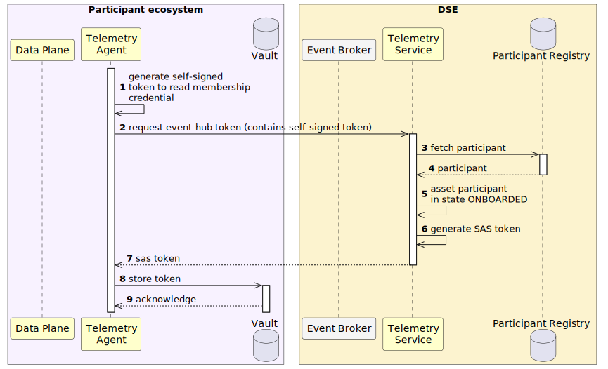
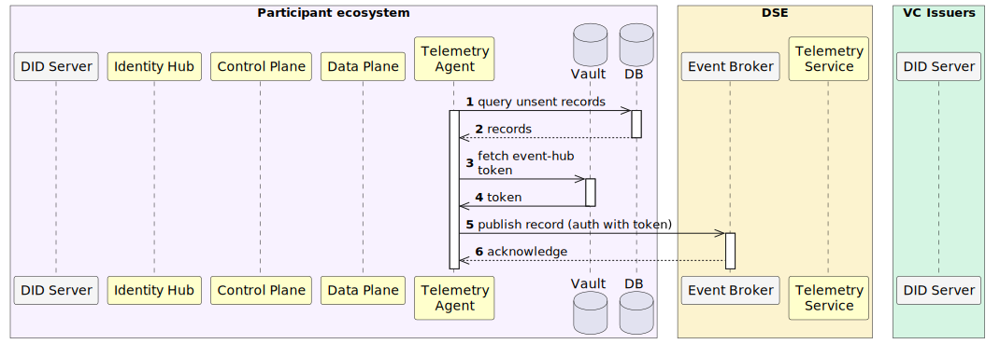
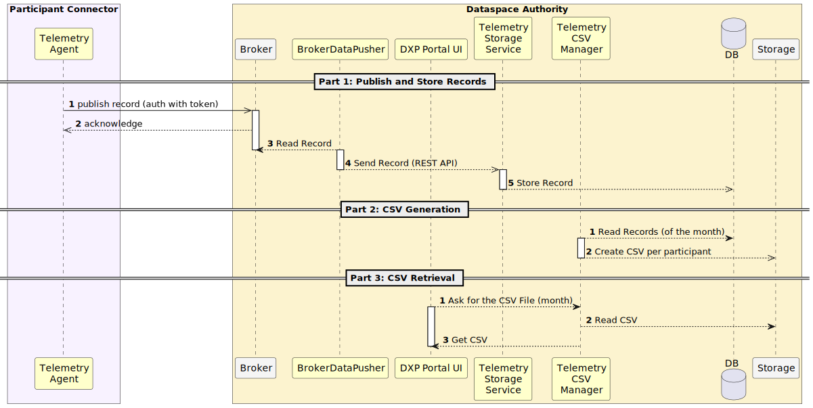

# Billing

Participants who want to charge for the use of their data need to know how many data queries have been performed by the
data consumer(s) and the volume of data that has been exchanged. To provide records about data consumption throughout
the dataspace, participants' data planes must log data exchanges to an event broker operated by Amadeus.

## Create Data Consumption Logs

A new extension in the data plane will log each successfully processed data request. This will be stored in the local
database as a `DataConsumptionRecord` object, containing two fields:

- `contractId`: The contract ID.
- `responseSize`: The size of the response in bytes.

This logic can be implemented as a `ContainerResponseFilter` registered for both the public and data contexts of the
data plane. Both the consumer and provider must log data consumption to prevent fraud.

<!-- Source: _diagrams/data_plane_logging.puml — Generated using: https://www.plantuml.com/plantuml -->

## (Re)generate SAS Token for Event Broker Connection

Participants' telemetry agent must regenerate at regular intervals a token for connecting to the Event Broker. This is
achieved by sending a SAS token request to the Telemetry Service. This request contains a signed token as header, which
contains the participant DID in the `iss` claim.

Upon reception, the telemetry service verifies the token and checks in the participant registry whether the requesting
participant is in state `ONBOARDED`. If yes, then a SAS token is generated and returned to the caller.

<!-- Source: _diagrams/eventhub_token_regeneration.puml — Generated using: https://www.plantuml.com/plantuml -->

## Push Logs to Dataspace Ecosystem Event Broker

The participant's telemetry agent pulls `DataConsumptionRecord` objects from the database and sends them to the Event Broker. Upon successful transmission, the record's state is updated to `SENT` state. Participants can configure a retention
period to remove sent records if needed.

<!-- Source: _diagrams/telemetryagent_push_to_eventbroker.puml — Generated using: https://www.plantuml.com/plantuml -->

## Create and Send the CSV to the Participant

Upon receiving data in the Event Broker, the 1st Azure Function processes each individual record and inserts them into a designated database within Azure. Subsequently, the 2nd Azure Function generates reports in CSV format, detailing all data exchanges. Each participant will receive a CSV file containing the following information:

- Contract ID
- Total size of all messages
- Number of messages received

The 2nd Azure Function also ensures data consistency to prevent fraud by verifying the following:

- Message size discrepancies
- Inconsistent message counts
- More than two participants associated with the same contract ID (which is not possible as each contract is a negotiation between exactly two participants)

The 3rd Azure Function (or Azure Email Communication Service) is responsible for retrieving the generated CSV files and distributing them to each participant. This enables participants to proceed with their billing procedures.

<!-- Source: _diagrams/eventhub_workflow_generate_participant_csv.puml — Generated using: https://www.plantuml.com/plantuml -->

## See Also

- [Telemetry Architecture](../architecture/components/telemetry.md) - Technical deep-dive into the telemetry system
- [Configuration](../getting-started/configuration.md) - Telemetry Agent and CSV Manager settings
