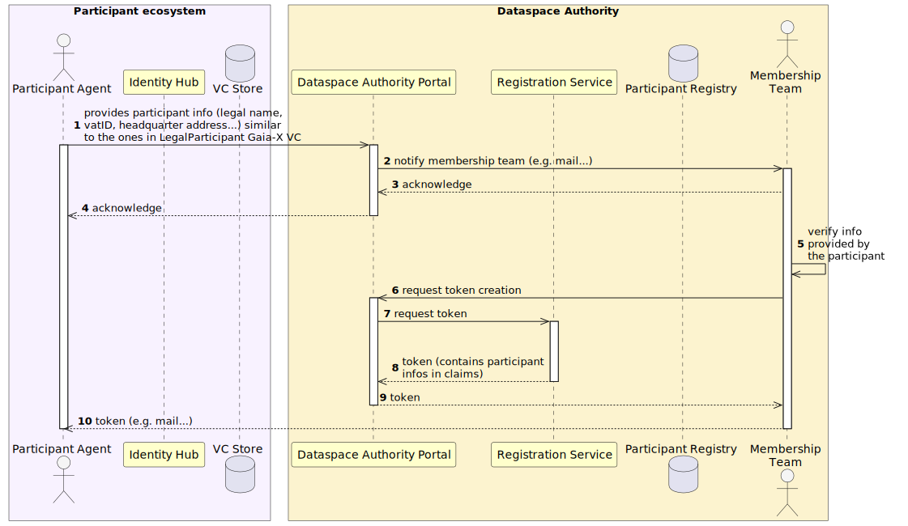

# Onboarding Flow

## Summary

The Dataspace Ecosystem onboarding process consists of two main steps: Administrative Onboarding and Technical Onboarding. In the
Administrative Onboarding step, participants fill out a form with essential company information, which is then verified
by Dataspace Ecosystem. Upon successful verification, a signed token is created and returned to the participant. In the Technical
Onboarding step, participants use this token to request a Dataspace Ecosystem membership credential. The registration service
verifies the token and enforces the onboarding policy. If the policy is validated, a Dataspace Ecosystem membership VC is created
and returned to the participant.

## Administrative Onboarding

The onboarding process begins with the participant filling out the onboarding form provided by the Dataspace Ecosystem dataspace
portal. This form collects essential information such as the company's legal name, VAT ID, headquarters address...
To ensure compatibility with Gaia-X, the information collected during the onboarding process should align with the
LegalParticipant Verifiable Credential (VC) defined in Gaia-X.

Upon completion, the portal notifies Dataspace Ecosystem, which uses the same portal to verify the participant's information. If the
verification is successful, Dataspace Ecosystem triggers the creation of a signed token through the registration service. This token,
which contains the participant's information in its `dse` claim, is then returned to the participant.

<!-- Source: _diagrams/administrative_onboarding.puml — Generated using: https://www.plantuml.com/plantuml -->

## Technical Onboarding

The second step of the onboarding process is to obtain the Dataspace Ecosystem membership credential. To do so, the participant first
sends the token generated at the previous step to the registration service along with its DID. After verifying the token,
the registration service creates an entry in the participant registry for the participant, and sets the status to
`VERIFIED`. In the response, the registration service provides the onboarding policy (ODRL format) that the participant
must fulfill in order to be able to onboard (if any). In other words, it tells the participant which VCs they will
have to present later on in order to receive the credential.

Next step is the actual membership credential request. Here the participant uses an API from its control plane and
provides the onboarding policy obtained at the previous step. From this policy, the control plane crafts a self-signed
token that gives permissions to an external entity to:

- fetching the VCs required to satisfy the onboarding policy from its identity hub,
- writing a membership credential to its identity hub.

The control plane then sends the membership credential request to the registration service which verifies the token and
resolves the Identity Hub URL from it. It uses the provided participant self-signed token to fetch the VCs required for
the onboarding policy validation (if any). VCs are fetched, verified, and finally used to enforce the onboarding policy.

If the policy is satisfied, the participant is transitioned to status `ONBOARDING` in the registry, and the participant
self-signed token is stored in the vault.

Finally, the state machine from the registration service (asynchronous handler) detects a participant is in status
`ONBOARDING`
in the registry and starts the membership credential delivery procedure. Specifically, it:

- uses the participant info to craft the membership credential with the appropriate data,
- fetches the participant self-signed token and resolves the Identity Hub VC issuance URL from it,
- pushes the membership credential to the Identity Hub,
- transitions the status of the participant to `ONBOARDED` in the registry.

<!-- Source: _diagrams/technical_onboarding.puml — Generated using: https://www.plantuml.com/plantuml -->

## Gaps

Estimated effort for each gap is provided between brackets.

- Onboarding form (will be replaced by Dataspace Ecosystem portal later on). **[LOW/MEDIUM]**
- Recover EDC registration service/participant registry + SQL participant registry implementation. **[MEDIUM]**
- Registration service internal API to deliver onboarding token. **[LOW/MEDIUM]**
- Control Plane extension to initiate onboarding/create self-signed token. **[LOW/MEDIUM]**
- Identity Hub VC issuance API (EDC upstream). **[MEDIUM/HIGH]**
- Registration service external API for onboarding initiate and asynchronous membership credential
  creation/publication. **[MEDIUM/HIGH]**
- Dataspace Ecosystem portal (optional for now). **[MEDIUM/HIGH]**

## See Also

- [Identity Hub Architecture](../architecture/components/identity-hub.md) - DID resolution, VCs, and the onboarding flow diagrams
- [System Overview](../architecture/system-overview.md) - High-level architecture and component map
